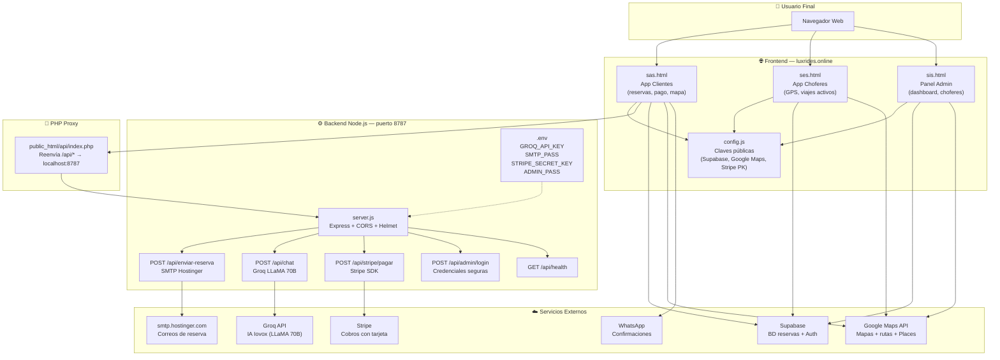
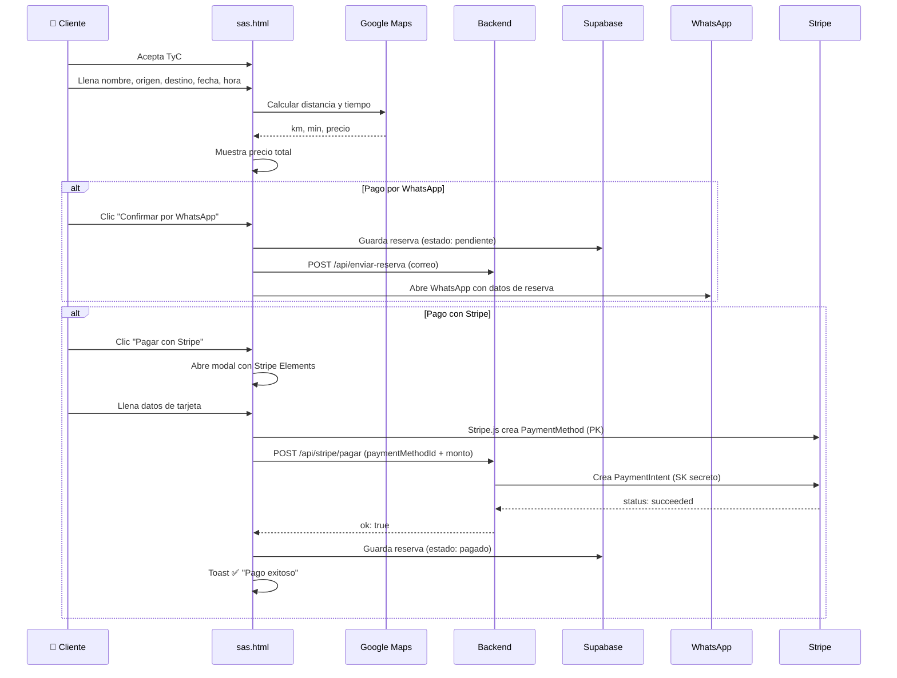
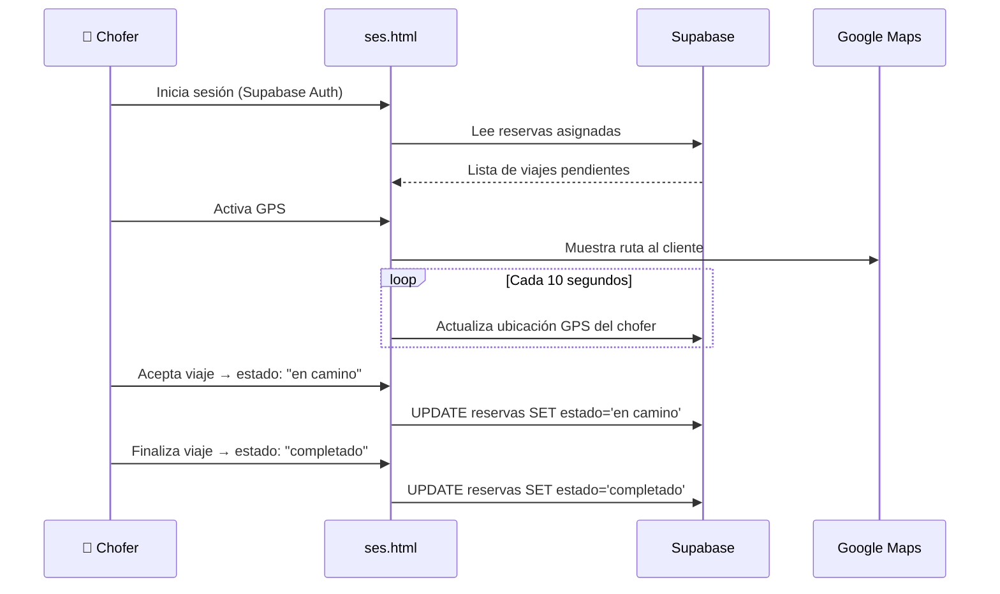
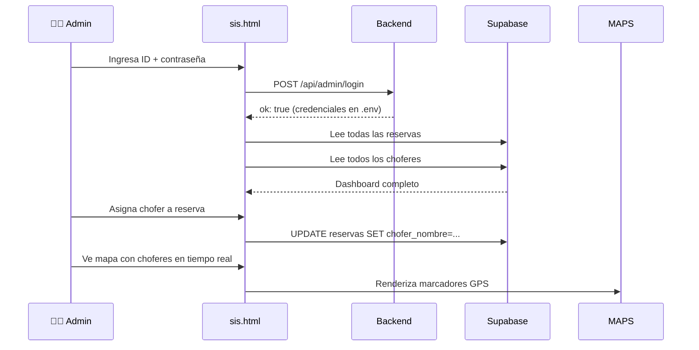
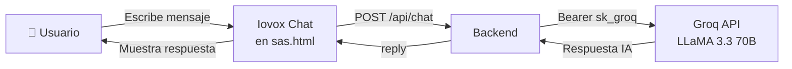
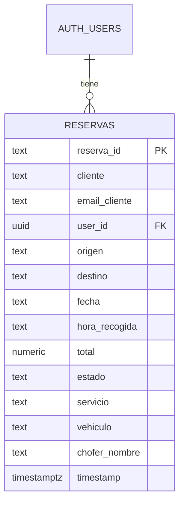

# LUXRIDES — Esquema de Arquitectura y Flujos

## 1. Arquitectura General



---

## 2. Flujo de Reserva — Cliente



---

## 3. Flujo Chofer — ses.html



---

## 4. Panel Admin — sis.html



---

## 5. IA Iovox — Asistente de Viajes



---

## 6. Tabla de Archivos

| Archivo | Rol | Tecnología |
|---|---|---|
| `luxrides.online/sas.html` | App clientes: reservas, mapa, pago | HTML + JS vanilla + Google Maps |
| `luxrides.online/ses.html` | App choferes: GPS, viajes | HTML + JS vanilla |
| `luxrides.online/sis.html` | Panel admin: dashboard | HTML + JS vanilla |
| `config.js` | Claves públicas (frontend) | JS IIFE |
| `backend/src/server.js` | Servidor HTTP | Node.js + Express |
| `backend/src/routes/stripe.routes.js` | Cobros con tarjeta | Stripe SDK |
| `backend/src/routes/chat.routes.js` | Proxy IA Iovox | Groq API |
| `backend/src/routes/email.routes.js` | Correos de confirmación | Nodemailer |
| `backend/src/routes/admin.routes.js` | Autenticación admin | Express |
| `backend/.env` | Secretos del servidor | dotenv |
| `public_html/api/index.php` | Proxy PHP → Node | PHP |

---

## 7. Base de Datos Supabase — Tabla `reservas`



---

## 8. Despliegue en Hostinger

```
/home/u351284767/
├── domains/
│   └── luxrides.online/
│       └── public_html/         ← Sitio web (Apache)
│           ├── index.html        ← Redirige a sas.html
│           ├── sas.html
│           ├── ses.html
│           ├── sis.html
│           ├── config.js
│           ├── .htaccess
│           └── api/
│               └── index.php    ← Proxy → localhost:8787
│
└── luxrides-repo/
    └── luxrides/
        └── backend/             ← Node.js (pm2)
            ├── src/
            ├── .env             ← SECRETOS (nunca en git)
            └── package.json
```

### Proceso de actualización
```bash
# 1. Editar en Codespace
# 2. Subir archivos
rsync -avz -e "ssh -p 65002 -i ~/.ssh/hostinger_key" \
  luxrides/sas.html u351284767@89.117.9.141:~/domains/luxrides.online/public_html/

# 3. Reiniciar backend si hubo cambios en él
ssh -p 65002 -i ~/.ssh/hostinger_key u351284767@89.117.9.141 \
  'source ~/.nvm/nvm.sh && pm2 restart luxrides-backend --update-env'
```
